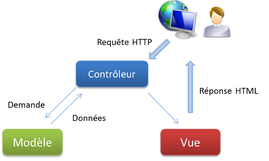

# Frameworks

Un framework est un regroupe de bibliothèque qui chacune se destine à une tache préciser (envoyer un mail, gérer les formulaires, gérer les URL...).

Dans un framework on retrouve un cadre de travail, on me dit où créer le fichier : oblige à avoir la bonne architecture. Le cadre de travail se matérialise par la doc et surtout par un squelette d'application (sources d'exemple avec déjà les bons répertoires).

## MVC

MVC : Model View Controller (Modèle Vue Contrôleur)

Design Pattern : Réponse standard à un problème de programmation

Design Pattern d'architecture qui sépare 3 types de code :

* Model : Données (Entity), Accès aux Données (Mapper), Validation...
* View : Rendu
  * HTML (ou autre)
  * echo
  * if .. else
  * foreach
  * appels à des fonctions de filtrages ou de rendu (htmlspecialchars)
* Contrôleur :
  * Chef d'orchestre (étant sur la page liste de contacts, je dois appeler la méthode findAll de VoitureMapper et transmettre le résultat à la vue index.phtml)
  * Gérer les problèmes HTTP (récupérer des paramètres dans l'URL, faire des redirections...)
  

  
[https://fr.wikipedia.org/wiki/Modèle-vue-contrôleur](https://fr.wikipedia.org/wiki/Modèle-vue-contrôleur)