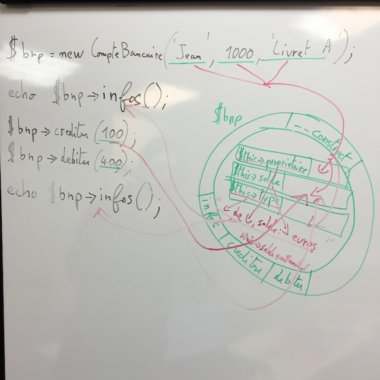

# PHP Objet

## Un objet
Un composant dans un programme qui regroupe des variables (aspect statique) et des fonctions (aspect comportement).

A propos des variables on parle de : 

* attribut,
* propriété,
* ou champ

A propos des fonction on parle de méthodes.

Concrètement on cherche à appliquer des concepts de la vie de tous les jours à la programmation.
Exemple, un ordinateur est un objet qui a des caractérisques (propriétés, ex: marque, modèle), et un comportement (méthodes, ex : démarrer, déplacer le curseur) et un type (classe).

## Une classe
Le type d'un objet et ce qui permet de le créer (construire). On compare souvent les classes à un moule (à gateau), permet de créer des objets qui ont une certaine forme.

Dans un programme on peut avoir une classe (ex : Ordinateur) et plusieurs objets créés en mémoire à partir de cette classe.

Un classe est la déclaration d'un concept (ex: Ordinateur) et l'objet son utilisation.

## Principe d'encapsulation
Les propriétés d'une classe ne doivent être accesibles qu'au travers de méthodes (jamais publiques en général protégées en PHP).

Intérets :

* moins il y de choses à connaitre à propos de la classe, plus elle est simple à utiliser (imaginer des propriétés complexes comme des sockets dans le cas d'une connexion à une base de données)
* permet au développeur qui a créé la classe que les autres développeurs qui vont l'utiliser n'intéragissent que avec vos propriétés de la manière dont vous l'avez prévu (ex : j'aimerai que la marque soit toujours en majuscule, limiter à la lecture...)



## Getters/Setters (accesseurs en français)
Comme les propriétés ne sont pas publiques, si le développeur de la classe souhaitent fournir un accès à ces propriétés il va créer des getters/setters. Ce sont des méthodes dont le noms est conventionné, pour la lecture : getLeNomDeLaPropriete, pour l'écriture setLeNomDeLaPropriete. Le getter retourne la propriété, le setter prend un paramètre d'entrée et modifie la propriété. Avec des IDEs comme NetBeans on peut les générer automatiquement.

## Associations

Quand on travaille en objet, on va lier les objets entre eux par des associations, ex : un contact qui travaille dans une société sera lié à la société.

L'association peut être unidirectionnelle si elle se fait que dans un sens. Ex : le contact connait la société, mais la société ne connait pas ses contacts. Si le lien peut se faire dans les 2 sens, elles est dites bidirectionnelle.

En PHP web, on ne fera le lien que dans un sens, si vous n'avez pas besoin de l'association ne la faites pas.

## Cardinalité

Il y a plusieurs types d'association, la cardinalité permet de la déterminer.

En gros, pour un objet il faut savoir combien on retrouvera d'objet lié en face.

Ex : une famille

Question : Pour un mari combien de femmes minimum et maximum ? 
Réponse : ça dépend, en France ? à un instant précis ? etc.. En général la maquette qui répond, mais on peut la question à la prochaine réunion.

Disons : Pour 1 mari on a entre 0 et 1 femme, pour 1 femme on a entre 0 et 1 mari. Le nom de la relation est déterminé à partir des cardinalités maximum, ici c'est une relation 1..1

Question : Pour une femme combien d'enfants ?
Réponse : 0 minimum et n maximum (ou *), pour un enfant 1, relation 1..n

Question : pour un enfant combien de frères et soeurs ?
Réponse : 1 enfant à entre 0 et n frères et soeurs, et en face un frère aura entre 0 et n frères et soeurs donc relation dite n..m (plusieurs - plusieurs).

En PHP :

Dans une classe si on a besoin de faire le lien vers une autre.

Soit il y a un seul objet possible dans le lien (ex : 1 contact lié à 1 société), c'est une simple variable

```PHP
<?php
class Contact
{
	protected $prenom;
	protected $nom;
	protected $email;
	protected $telephone;
	
	/**
	 *
	 * @var Societe 
	 */
	protected $societe;
	
	public function getSociete()
	{
		return $this->societe;
	}
	
	public function setSociete(Societe $societe)
	{
		$this->societe = $societe;
		return $this;
	}
	
	// getters/setters et autres ...
}
```

Soit il y a plusieurs objets possibles dans le lien (ex : plusieurs contact dans 1 société), c'est une variable de type tableau.

```PHP
<?php
class Societe
{
	protected $nom;
	protected $ville;
	
	/**
	 *
	 * @var Contact[]
	 */
	protected $contacts = [];
	
	public function getContacts()
	{
		return $this->contacts;
	}
	
	public function addContact(Contact $contact)
	{
		// ajoute à la fin du tableau
		$this->contacts[] = $contact;
	}
	
	// getters/setters
}
```
	
Dans Symfony (Doctrine) les associations sont nommées OneToOne, ManyToOne (la plus répandue), OneToMany (l'inverse de ManyToOne), ManyToMany.

